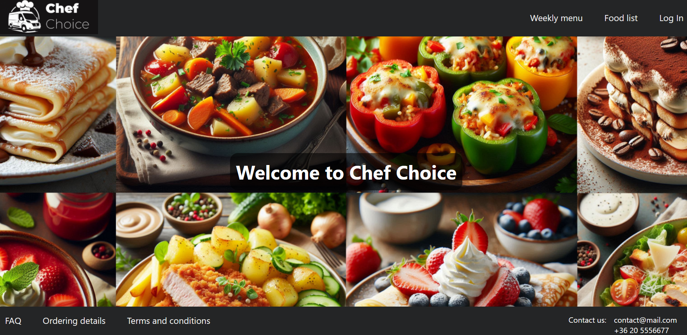
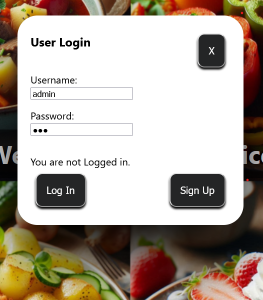
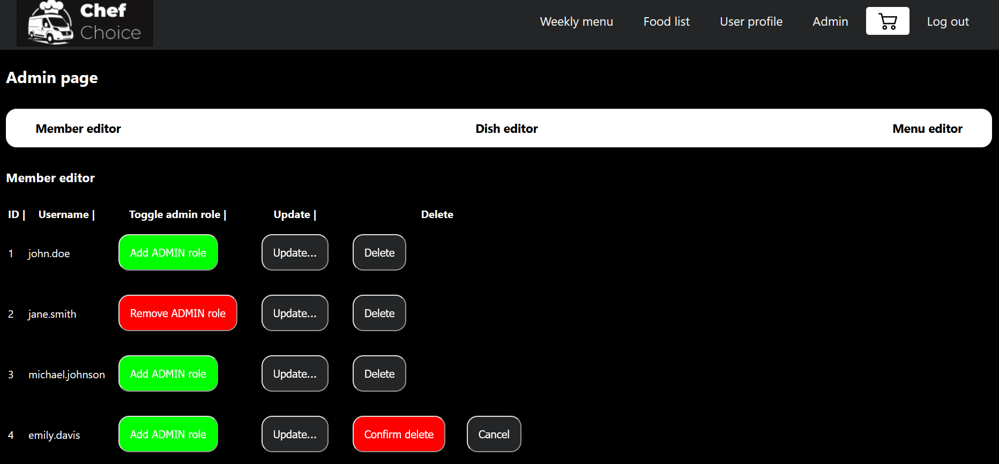

# Chef Choice - a classic weekly menu ordering app

## What is Chef Choice?

Chef Choice is a classic prepared meal delivery service, where clients can choose and order their lunch and have them delivered to their home. 

## Main features

- Weekly menu view
- Selecting and ordering dishes
- Security and user management
- Admin page for editing content
- Review orders (TODO)
- Filtering function (TODO)
- Favorite dish and dish rating (TODO)

[//]: # (TODO - Add screenshot of weekly menu page)

## Technologies
- Frontend: React-Vite, Vanilla CSS
- Backend: Spring Boot with Spring Data JPA and Spring Security
- Database: PostgreSQL
- Docker Compose

## Developers
- [Kriszta Antal](https://github.com/KrisztaAntal)
- [Levente Fülöp](https://github.com/fulopl)
- [Péter Zsigri](https://github.com/ZsigriPeter)

[//]: # (TODO - Replace with steps to run docker compose)
## How to run this app?
### Prerequisites

Ensure the following are installed on your computer:
- Java 17
- Maven 3.9+
- Docker
- PostgreSQL
- Node.js and npm (for the frontend)

### Installation
To set up the project locally:

[//]: # (TODO - Check correctness of text below)
## How to use?  
- Register a new user: selecting the "Log In" tab click the "Sign Up" button and fill the required fields, then click save.
- Then login with the username / password combination given by you in the previous step
- You can also log in with the test users created in advance:
  - User with basic user rights:
    - username: user
    - password: 123
  - User with admin rights:
    - username: admin
    - password: 123

- After logging in you can use all the basic features of the application (selecting and ordering meals, check detailed information, check previous orders). 
- With admin rights, you can also use the features under the "Admin" tab, where you will be able to edit different types of content of the website.

